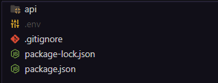

# Documentação JUMBO api de pagamentos v1.2.0

# Guia de instalação

Para iniciar o processo de instalação você deve ter instalado no seu computador ou servidor o **Nodejs 20.14**

## Instalar Nodejs no windows

### Download Nodejs

link para download: [https://nodejs.org/en/download/prebuilt-installer](https://nodejs.org/en/download/prebuilt-installer)

- Escolha a versão 20.14 do Nodejs
- Escolha seu sistema operacional
- Escolha a versão do seu sistema
- Clique em **Download Node.js v20.14.**


## Instalar Nodejs no Linux

Baseados em Debian/Ubuntu

no terminal

```bash
curl -o- https://raw.githubusercontent.com/nvm-sh/nvm/v0.39.7/install.sh | bash
nvm install 20
```

Feche o terminal caso esteja usando linux no modo interface(**Desktop**), caso esteja usando somente no modo terminal(**server**) reinicie a maquina.

Agora teste se a instalação deu certo.

```bash
node -v # should print `v20.14.0` 
```

## Instalar Dependências

Para instalar as dependências do projeto abra o seu terminal na pasta raiz da api    



No terminal digite

```bash
npm install
```

se ocorrer tudo bem 


## Configurando Variáveis de Ambiente

crie um arquivo na raiz do protejo chamando **.env** dentro do arquivo coloque a seguinte configuração.

```
API_PORT = "4700"
```

Essa e a configuração da porta da API, escolha uma porta que não esteja em uso e que não corra o risco de nenhuma outra aplicação usar pois pode ocorrer o risco da API desligar nesse processo ou na próxima vez que ela for iniciada ocorra algum erro.

Após essa configuração a API está pronta para ser inicializada

## Inicializando a API

Para inicializar a API digite o seguinte comando no terminal 

```bash
npm run start
```

se ocorrer tudo bem


# Pagamentos

## Pix

### Criar pagamento(mercadopago)

Para criar um pagamento use a rota ( **https://seudominio/payment/mercadopago/** )

método **POST**

Exemplo do pedido do pagamento  com produto!  **todos os dados são obrigatórios**

```json
{
  "paymentData": {
    "paymentId": "id do pagamento",
    "paymentDescription": "descrição do pagamento",
    "paymentMethod": "pix",
    "paymentAmmount": 10,
    "paymentAccessToken": "seu access token (credencial de produção)",
    "paymentNotificationUrl": "caso tenha um webhook coloque aqui, caso não tenha coloque a url da sua aplicação"
    "paymentProducts": [
      {
        "id": "id do produto",
        "title": "nome do produto",
        "quantity": 1, 
        "unit_price": 1500,
        "description": "descrição do produto"
      }
    ]
  },
  "paymentPayerData": {
    "paymentPayerEmail": "teste@pnemail.com",
    "paymentPayerIndentificationType": "CPF",
    "paymentPayerIndentificationNumber": "12345678909"
  }
}
```

Exemplo do pedido do pagamento sem produto! **todos os dados são obrigatórios**

```json
{
  "paymentData": {
    "paymentId": "id do pagamento",
    "paymentDescription": "descrição do pagamento",
    "paymentMethod": "pix",
    "paymentAmmount": 10,
    "paymentAccessToken": "seu access token (credencial de produção)",
    "paymentNotificationUrl": "caso tenha um webhook coloque aqui, caso não tenha coloque a url da sua aplicação"
    "paymentProducts": []
  },
  "paymentPayerData": {
    "paymentPayerEmail": "teste@email.com",
    "paymentPayerIndentificationType": "CPF",
    "paymentPayerIndentificationNumber": "12345678909"
  }
}
```

Exemplo de retorno

```json
{
  "id": 0000000000,
  "status": "pending",
  "statusDetail": "pending_waiting_transfer",
  "aproved": null,
  "created": "2024-06-05T07:40:03.932-04:00",
  "value": 20,
  "pixData": {
    "qrcodeImage": "imagem do qr code do pagamento pix",
    "qrcode": "copia e cola do pagamento pix"
  }
}
```

### Checar pagamento(mercadopago)

Para criar um pagamento use a rota ( **https://seudominio/payment/mercadopago/check/** )

método **POST**

Exemplo de checagem de pagamento

```json
{
  "paymentId":"0000000000",
  "paymentAccessToken":"seu access token (credencial de produção)"
}
```

Exemplo de retorno

```json
{
  "id": 0000000000,
  "status": "pending"
}
```